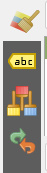
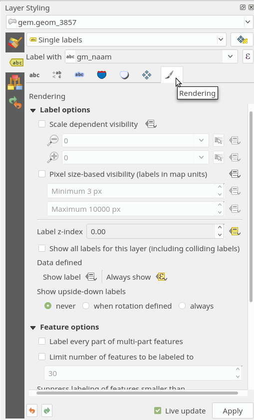
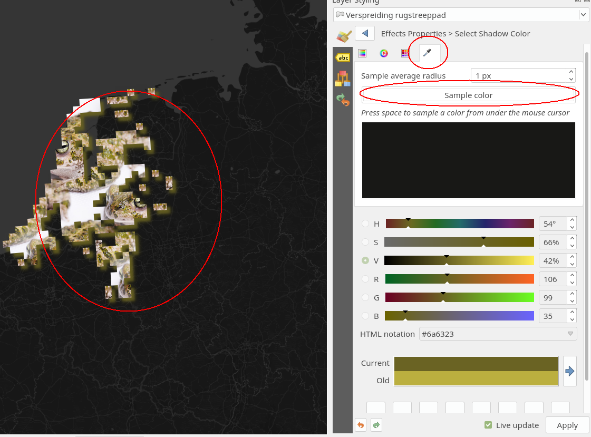

# Cartografie in Qgis

In deze workshop werken we met Qgis versie > 3.0. Zorg dat je deze geïnstalleerd hebt. Zie https://www.qgis.org/en/site/ voor de installatie instructies.

Maak een werk folder aan op je computer en download de benodigde data van https://github.com/NieneB/qgis-cartografie.
Hier vind je deze beschrijving, de plaatjes en de data die we gaan gebruiken.

* in de folder `/data` staat de geodata
* in de folder `/style_img` staan de benodigde plaatjes.

Daarnaast gebruiken we data van PDOK en bestaande achtergrond kaarten van CartoDB. 

## 1. Voorbereiding.

1. Open Qgis en start een lege kaart.  **Project > New**
4. Sla het project op in je werk folder. Zorg ervoor dat je regelmatig op `Opslaan [Ctrl+S]` drukt tijdens de workshop.
2. Zet de layer styling panel klaar. **View > Panels > Layer styling** Verplaats het naar de rechterkant van je scherm. Of druk F7.
3. Installeer de volgende plug-ins :
    * QuickMapServices
    * PDOK Services Plugin
    * Vector Tiles Reader

**Plugins > Manage and Install Plugins > Search .. > Install Plugin**

## 1. Live Interactive Styling in QGis 3! 

Een nieuwe feature in Qgis 3 is de Layer Styling Dock. Waardoor je direct kan zien wat de instellingen doen met visuele weergave van je data. Ook hoef je niet elke keer de properties van een laag te openen en te sluiten. De Layer Styling Dock past zich direct aan op de laag waar je mee werkt.

* Bovenaan kun je de laag selecteren die je wilt stijlen. 

* De tabs die beschikbaar zijn:
    - Stijl opties
    - Label opties
    - Stijl opslaan
    - Undo

* Onderaan in het blauw de mogelijkheid om de live rendering aan en uit te zetten.

* In het groen bovenaan, de stijling van de Features. 
* In het groen onderaan, de stijling op de Layer. 

Voor deze workshop laten we dit paneel altijd op de voorgrond staan en we zullen hier het meest mee bezig zijn.

## 2. QuickMapServices Achtergrondkaart

QuickMapServices is een plugin waarmee je verschillende basemaps kan toevoegen aan je project. 

 

1. Klik op het meest linkse icoontje van QuickMapServices boven in de balk. 

Er staan maar een paar providers in de lijst maar er zijn er veel meer! Laten we deze ook meteen toevoegen. 

2. Ga naar **Settings** van QuickMapServices

 

3. Ga naar de tab: **More Services**
4. Klik op **get contributed pack**
5. Accepteer en save. 

Nu hebben we veel meer providers van basemaps in de lijst staan! Sluit het **Settings** venster.

1. Klik weer op het **QuickMapServices icoontje**. 

 

6. Kies **CartoDB > Dark Matter [no labels]** 
7. Zoom in naar Nederland. 

De kaart is erg donker maar daar kunnen we wat aan doen. 

8. Selecteer de Basemap layer in de **Layers** paneel aan de linker kant van het scherm. 

Nu zie je in het **Layer Styling** paneel aan de rechterkant de opties voor deze laag. Als het goed is staat er boven in de naam van de laag: Dark matter [no labels].
Een basemap is een voor gedefineerde stijl. We kunnen hier dus niet zo veel op aanpassen. Maar we kunnen wel een klein beetje de **Layer Rendering** veranderen. 

9. Zet de `Brightness` op 20.

We zijn klaar met onze achtergrond! Als het goed is ziet je scherm er nu zo uit:

## 3. PDOK plugin voor data

Met de PDOK plug-in kan je heel gemakkelijk Nederlandse geo data en services inladen in Qgis. Wij willen graag de landsgrens van Nederland hebben. 

1. Klik op het PDOK plugin icoontje links. 

Nu opent zich het volgende venster:

2. Zoek op : `Landsgrens`
3. Er zijn 2 bronnen beschikbaar. Kies de WFS service van de landsgrens. 
4. Voeg deze laag toe en sluit het PDOK venster. 

Je ziet nu de landsgrens van Nederland op de kaart!

5. Selecteer de landsgrens laag in de **Layers** paneel aan de linker kant van het scherm.  De **Layer Styling** paneel aan de rechterkant van het scherm is nu gericht op de landsgrens laag. Zie je de naam boven in staan? Je kan hier ook kiezen welke laag je wilt stijlen. 

6. Klik op het Dropdown menu waar nu `Single Symbol` staat en kies nu `Inverted Polygons`.
7. Klik op `Simple fill` en zet de `Fill Color` naar wit.
8. Zet de  `Stroke style` op `No pen`

### Draw Effects!
We gaan nu de **Draw Effects** ontdekken. Let op waar je een effect op zet. Je kan deze op de laag zetten, op een feature zetten maar ook op verschillende onderdelen van de feature. 

9. Vink de `Draw Effects` aan en klik op de knop. 

Per feature style kan je extra laagjes met effecten toevoegen. Zoals schaduwen en glows. We willen de witte source laag wel doorzichtig hebben maar de schaduw die we straks gaan toevoegen niet. Let op, als je de hele Layer een opacity geeft geld dit dus ook voor de schaduw die daarbij hoort. Zet je de Feature opacity dan gebeurt hetzelfde. Daarom gaan we hier eerst de Source aanpassen. 

10. Zet de Source opacity op 15%. Dit zorgt ervoor dat alleen de source laag doorzichtig wordt!
11. Voeg een Inner Shadow toe door het vinkje ervoor aan te zetten. Zorg dat deze BOVEN de Source staat in het lijstje. Deze schaduw heeft een opacity van 50%.  
12. Geef de Inner Shadow een lichtgrijze kleur en een grootte van 1 mm. 

Nu hebben een sjabloon van Nederland!
De kaart ziet er nu ongeveer zo uit:

Misschien is de achtergrond kaart nu zelfs iets te licht geworden. Laten we de Brightness maar weer terug zetten naar de default waarden. 

13. Selecteer de Basemap layer en zet de Brightness terug op 0. 

**Ben creatief! Dit effectje kan je natuurlijk ook op de BRT achtergrond kaart uithalen:**

## 4. Thematische data van CBS 

1. Ga weer naar de PDOK plugin.
2. Zoek op : `gemeenten2017`.
3. Voeg de WFS service van de CBS gemeenten grenzen toe. Het duurt even voor alle geometrieen van de gemeentes zijn binnengehaald. Ondertussen kunnen we wel alvast beginnen met de styling. 

In plaats van de gemeenten grenzen willen we een punt per gemeenten. 

4. Selecteer de gemeenten2017 laag in het **Layers** paneel om deze te gaan stijlen. 
5. In het **Layer Styling** paneel klik je op de `Simple Fill`
6. Bij `Symbol layer type` kunnen we de Simple Fill omzetten naar een `Centroid fill`. 
7. Vink de `Force point inside polygon` aan. 
8. Vink `Draw point on every part of multi-part features` uit. 

### Grootte marker gebaseerd op oppervlakte.

9. Selecteer de `Marker`.

De grootte van de cirkels willen we op de oppervlakte van de gemeenten zetten. 

10. Klik op het extra menu naast de `Size` en kies `Edit...`

Er open zich nu een Expression String Builder venster waar wij zelf kunnen berekenen hoe groot we de cirkel willen hebben op basis van de data.

11. Voer links de volgende code in: 

        CASE
        WHEN ("oppervlakte_land_in_ha"= -99999999)
        THEN 0
        ELSE ("oppervlakte_land_in_ha" / 46005) * 10
        END

Met de `CASE WHEN .. THEN .. ELSE .. END` statment halen we de Null waarden in de tabel eruit. 
"oppervlakte_land_in_ha" is een attribuut van de data. `46005` is de maximum oppervlakte die voorkomt in de data. Daardoor worden de waarden tussen de 0 en 1 geschaald. Punten schalen tussen 0 en 1 is een beetje te klein, daarom x 10. Zo wordt de groote van de cirkel geschaald tussen 1 en 10.

10. Selecteer de `Simple Marker` in de **Style Layers** paneel. 
11. Zet de **Stroke Style** op **No Pen**
10. Helemaal onderaan vind je de knop voor **Draw Effects**. Scroll dus helemaal omlaag. 
11. Activeer deze en ga naar de Draw Effects. 

12. Activeer de **Drop Shadow**
13. Zet de grootte op 2 pixels en de blur op 3. 

### Kleur op aantal inwoners 

Nu gaan we de cirkels data gedreven kleuren. In plaats van Single Symbol kiezen we voor Graduated boven in het drop down menu. 

2. Verander de styling naar `Graduated`
3. Zet `Column` op `aantal_inwoners`
4. Zet de Mode op Standard Deviation en klik Classify. 
5. Kies een andere `Color ramp` en zorg er voor dat de rode kleur bij de meeste aantal inwoners hoort. Dit kan je doen door `Invert Color Ramp` aan te klikken. 

Zie het plaatje hier onder voor de instellingen:

Zoals je ziet verknallen de -99999999 waarden in de data behoorlijk de visualisatie! Laten we deze er uit halen. 

1. Dubbel klik op de Layer gemeenten2017 . Nu opent zich alle **Layer Properties** voor de laag gemeenten2017. 
2. Ga naar het tab blad: **Source**. Hier kunnen we een feature filter toevoegen. 
3. Klik op de knop `Query Builder`
4. Voer in 

        "aantal_inwoners" != -99999999

5. Druk op `OK` en sluit de Layer Properties venster. 

6. Klik in de **Layer Styling** paneel opnieuw op `Classify`.

Nu zijn de bollen zowel in groote als in kleur aangepast op de data! Het zou er nu ongeveer zo uit moeten zien:

## Labels

Voeg nog een keer de gemeenten grenzen toe aan het project en zet de oude laag uit. We gaan kijken naar de gemeenten naam labels! 

1. Selecteer de **Simple fill** van de gemeenten polygonen en zet de **Fill style** op: **No Brush**.
2. Zet de **Stroke color** op grijs. De **Stroke width** op 1 pixel en de **Stroke style** op **Dot line**. 
3. De **Join style** op **Round**

Speel met deze waarden als je wilt, zodat je mooie subtiele gemeenten grenzen hebt. 

4. Ga naar de Label tab! Dit is de tweede tab aan de linkerzijde op het **Layer styling** paneel. 

1. Verander de **No labels** naar **Single labels**
2. Zet de **Label with** op de kolom naam met de gemeente naam. 

Nu kunnen we de labels gaan stylen. 

3. Verander het font!
4. Zet de kleur op wit. 
5. Verander de grootte naar 8. 

### Labels Stijlen op aantal inwoners

1. Klik op het extra menu icoontje naast **Size**.

2. Ga naar **Assistant**

Hier kunnen we de grootte van het font laten afhangen van een waarde in de data!

3. Zet de **Source** op aantal inwoners. 
4. Door op de blauwe pijltjes te drukken berekend het programma de max en min waarden van het aantal inwoners voor je! 
5. De Output zijn de font grootte waarder waartussen hij de data waarden gaan interpoleren. Zet deze van 5 tot 16. 

6. Zelfs de curve van de interpolatie kan je aanpassen! 

7. Ga naar de tab **Placement**

8. Zet dezelfde settings in. 
9. Ga naar de tab **Rendering**

De **Label z-index** zorgt voor de hierarchy waarmee de labels gerenderd worden. Klik op het extra menu knop ernaast en ga naar de  **Assistant**.
Ook hier kunnen we de z-index afhankelijk maken van het aantal inwoners. 
Let op de curve! De data is niet mooi verdeeld. Het is dus handig om deze handmatig aan te passen:

We hebben alsnog een probleem met de labeling van Amsterdam. Omdat er meerdere polygonen zijn die deze naam bevatten kan Qgis niet kiezen welke hij wel of niet moet renderen. 
Om af te dwingen dat bepaalde labels áltijd aanwezig zijn kunnen we naar het edit menu gaan van **Data Defined > Always show**

10. Klik op de menu knop en ga naar edit.

Voer in:

        "gm_naam" = 'Amsterdam'

Nu is de label Amsterdam altijd zichtbaar! Je resultaat zal er nu ongeveer zo uit zien: 

Niet echt mooi of optimaal. Een reden hiervoor is, is dat de gemeenten data set totaal niet goed ontworpen is om labels van te maken! 

*Uitdaging*: speel met de settings tot je wel tevreden bent! 

## Labels 2

7. Ga naar de tab **Placement**

8. Zet de **Placement** op **Using Perimeter(curved)**
9. **Allowed Positions** op **Right of line**
10. Vink de **Line orientation dependent position** aan.
11. Zet **Repeat** op 1000 **Map Units**

<!-- 
### Data inladen.

Voeg de volgende laag toe aan het project:

* random_routes.gpk

Je kan dit doen door het bestand in het Qgis scherm te slepen of door te klikken op de `Add Vector Layer` knop.

Zorg dat de laag boven je basemap komt te staan.

1. Nu gaan we de lijnen stylen. Klik op de laag in de `Layers` paneel. In de `Layer Styling` paneel komen nu de opties voor de random routes lijnen te staan.

2. Klik op de `simple line`
3. Naast `stroke width` staat een icoon voor een extra dropdown menu. Klik hier op en ga naar > `Edit...`

Er open zich nu een Expression String Builder venster waar wij zelf kunnen berekenen hoe dik de lijnen moeten worden. Zo kunnen we de lijn dikte laten afhangen van een attribuut. 

4. Vul in:

        (1 - ("distance" / 258489.79))/6

"distance" is een attribuut van de data. `258489.79` is de maximum distance die voorkomt in de data. Daardoor worden de waarden tussen de 0 en 1 geschaald. We willen de dikte van de lijn het dunst hebben bij de langste afstand daarom moeten we de inverse hiervan pakken: `-1`. De lijn dikte is mooier als het nog dunner is dus delen we het nog maar eens door 6.

5. Kijk wat er gebeurt als je de waardes veranderd! 

 -->

### Lelijke data, mooi plaatje!

In de PDOK sercvices plugin zit ontzettend veel data. Op gegeven moment stuitte ik tegen de Fauna verspreidingsgebieden aan. Een beetje blokkerige data zonder inhoud. Laten we daar eens wat moois mee gaan maken! 

Laat de basemap staan. Maar zet de Landsgrens layer en alle andere data uit.    

1. Ga weer naar de PDOK plugin.
2. Zoek op : `rugstreeppad`.
3. Voeg de WFS service van de rugstreeppad verspreiding toe.

Als je de attribuut data bekijkt zul je ook niet veel interessants vinden. Behalve mischien de officele soort naam en de common naam. 
Laten we eens kijken of we deze data toch leuk kunnen laten zien! 

1. Selecteer de laag en ga naar de Layer Styling panel. 
2. Verander de `Symbol layer type` naar `Raster image fill` 
3. Klik op de 3 puntjes knop. 

4. Kies het plaatje uit `/img/rugstreeppad.jpg` 
5. Zet image width op 500
6. Zet Coord mode naar Object
7. Voeg een `Draw effect` toe. 
8. Kies een `Drop shadow` 
9. klik op de kleur en ga naar het pipetje. Nu kun je een kleur uitzoeken. 
10. Klik op de knop Sample Color en kies een kleur uit het padden plaatje! Zo past de schaduw kleur dadelijk perfect bij het beeld. 

11. Klik op Apply. 