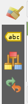
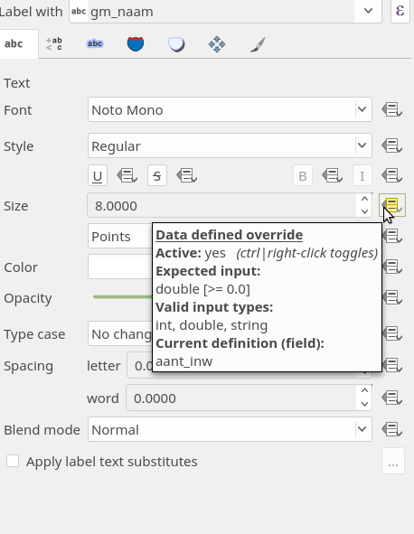
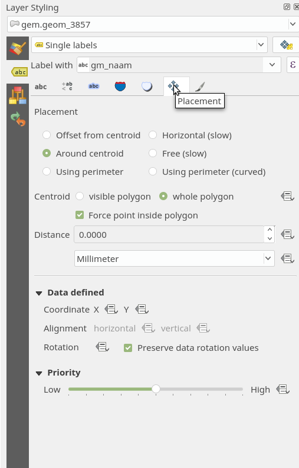
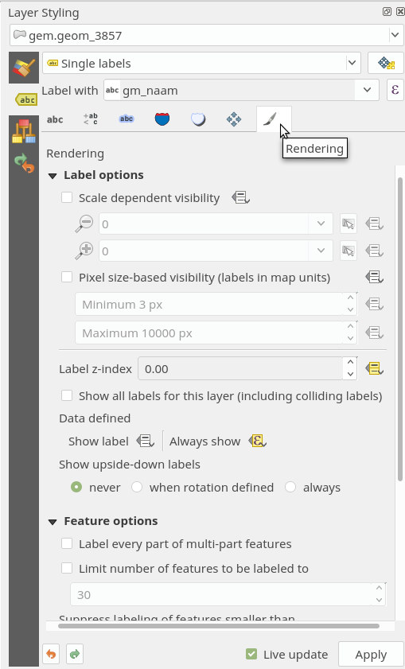
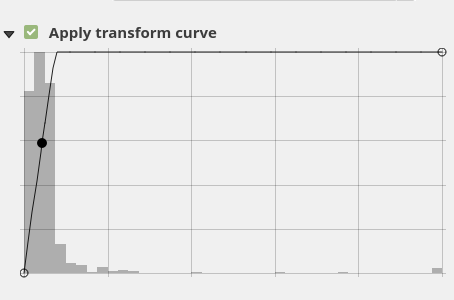
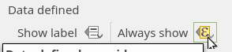
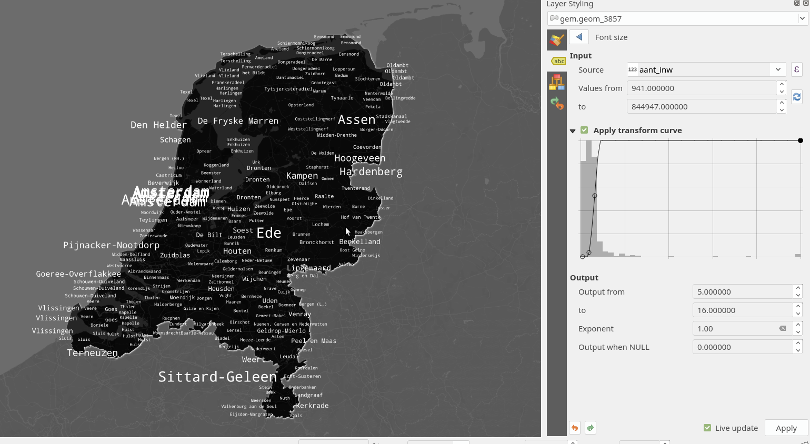
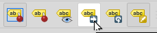

# Labels

Voeg nog een keer de gemeenten grenzen toe aan het project en zet de oude laag uit. We gaan kijken naar de gemeenten naam labels! 

1. Selecteer de **Simple fill** van de gemeenten polygonen en zet de **Fill style** op: **No Brush**.
2. Zet de **Stroke color** op grijs. De **Stroke width** op 1 pixel en de **Stroke style** op **Dot line**. 
3. De **Join style** op **Round**

Speel met deze waarden als je wilt, zodat je mooie subtiele gemeenten grenzen hebt. 

Je zou dit effect ook kunnen doen door in plaats van een **Simple Fill** te kiezen voor **Outline: Simple line**. Probeer maar eens uit. De polygonen worden dan niet als vlakken maar als lijnen getekend.

4. Ga naar de Label tab! Dit is de tweede tab aan de linkerzijde op het **Layer styling** paneel. 

1. Verander de **No labels** naar **Single labels**
2. Zet de **Label with** op de kolom naam met de gemeente naam. 

Nu kunnen we de labels gaan stylen. 

3. Verander het font!
4. Zet de kleur op wit. 
5. Verander de grootte naar 8. 

### Labels Stijlen op aantal inwoners

1. Klik op het extra menu icoontje naast **Size**.

2. Ga naar **Assistant**

Hier kunnen we de grootte van het font laten afhangen van een waarde in de data!

3. Zet de **Source** op aantal inwoners. 
4. Door op de blauwe pijltjes te drukken berekend het programma de max en min waarden van het aantal inwoners voor je! 
5. De Output zijn de font grootte waarder waartussen hij de data waarden gaan interpoleren. Zet deze van 5 tot 16. 

6. Zelfs de curve van de interpolatie kan je aanpassen! 

7. Ga naar de tab **Placement**

8. Zet dezelfde settings in als in het plaatje hierboven. 
9. Ga naar de tab **Rendering**

De **Label z-index** zorgt voor de hierarchy waarmee de labels gerenderd worden. Klik op het extra menu knop ernaast en ga naar de  **Assistant**.
Ook hier kunnen we de z-index afhankelijk maken van het aantal inwoners. 
Let op de curve! De data is niet mooi verdeeld. Het is dus handig om deze handmatig aan te passen:

We hebben alsnog een probleem met de labeling van Amsterdam. Omdat er meerdere polygonen zijn die deze naam bevatten kan Qgis niet kiezen welke hij wel of niet moet renderen. 
Om af te dwingen dat bepaalde labels áltijd aanwezig zijn kunnen we naar het edit menu gaan van **Data Defined > Always show**

10. Klik op de menu knop en ga naar edit.

Voer in:

        "gm_naam" = 'Amsterdam'

Nu is de label Amsterdam altijd zichtbaar! Je resultaat zal er nu ongeveer zo uit zien: 

Niet echt mooi of optimaal. Een reden hiervoor is, is dat de gemeenten data set totaal niet goed ontworpen is om labels van te maken! 

*Uitdaging*: speel met de settings tot je wel tevreden bent! 

## Labels versie 2

7. Ga naar de tab **Placement**

8. Zet de **Placement** op **Using Perimeter(curved)**
9. **Allowed Positions** op **Right of line**
10. Vink de **Line orientation dependent position** aan.
11. Zet **Repeat** op 1000 **Map Units**

12. Zet de grootte van de text weer op 1 soort grootte. 

## Handmatig plaatsen van labels

Een nieuwe functie van Qgis 3 is het handmatig plaatsen van labels:

Als je deze toolbar niet ziet ga dan naar:

View > Toolbars > Label Toolbar

From [Stack](https://gis.stackexchange.com/questions/67408/how-does-manual-label-placement-in-qgis-1-9-work/67546#67546)

* **Highlight Pinned Labels:** Shows or hides a shaded 'outline' box around the labels that have been manually moved. Highlight is cyan when layer is not editable, and green when editable.

* **Pin/Unpin Labels:** Changes a label from 'auto' label settings to manual label settings. This will remove all rotation, and change the position of the label. You must then manually set this using the move and rotate tools. Note: Layer must be editable for this tool to be active.

* **Show/Hide Labels:** Displays (Click) or hides (Shift-Click) the label for the feature you click. Note: Layer must be editable for this tool to be active. Note 2: Layer must have a data defined column set for visibility for this tool to be active. To do this, create an integer column (named "visibility' for example), and assign it in the label properties under Rendering > Show Label > YourColumnName

* **Move Label:** Allows you to change the position of the label. Changing the position will "Pin" the label as well. This will remove all rotation, and change the position of the label. Note: Layer must be editable for this tool to be active. Note 2: Layer must have a data defined column set for x and y position for this tool to be active. To do this, create 2 'double' (aka decimal or real) columns (named "LabelX" and "LabelY" for example), and assign them in the label properties under Placement > Data Defined > X and Y

* **Rotate Label:** Allows you to change the rotation of the label. You must first "Pin" the label before you can rotate it. Note: Layer must be editable for this tool to be active. Note 2: Layer must have a data defined column set for Rotation for this tool to be active. To do this, create a 'double' (aka decimal or real) column (named "Rotation" for example), and assign it in the label properties under Placement > Data Defined > Rotation

* **Change Label:** Brings up additional options to change the particular label you clicked. Here you can set things such as the specific font/size/colour, buffers, etc. These all need to have their own columns defined, and the label properties set to use them as 'data defined' fields.

Probeer wat labels op een betere plaats te krijgen!