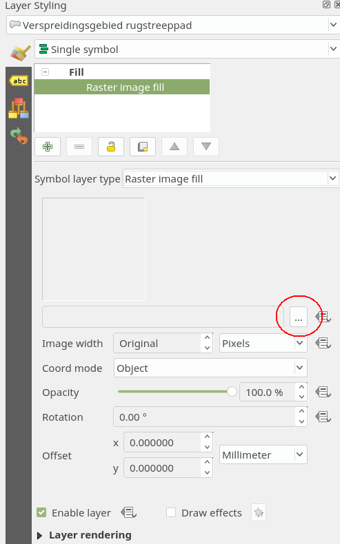
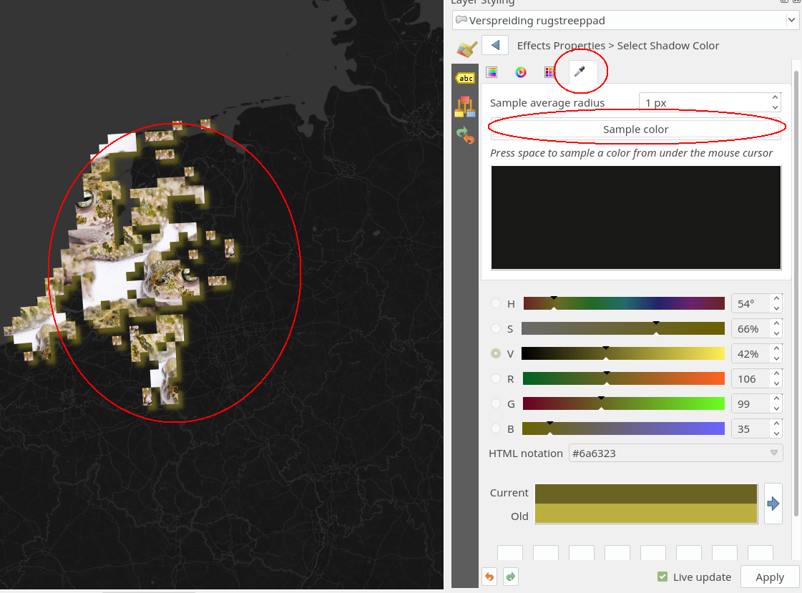

### Lelijke data, mooi plaatje!

In de PDOK sercvices plugin zit ontzettend veel data. Op gegeven moment stuitte ik tegen de Fauna verspreidingsgebieden aan. Een beetje blokkerige data zonder inhoud. Laten we daar eens wat moois mee gaan maken! 

Laat de basemap staan. Maar zet de Landsgrens layer en alle andere data uit.    

1. Ga weer naar de PDOK plugin.
2. Zoek op : `rugstreeppad`.
3. Voeg de WFS service van de rugstreeppad verspreiding toe.

Als je de attribuut data bekijkt zul je ook niet veel interessants vinden. Behalve misschien de officiële soort naam en de common naam. 
Laten we eens kijken of we deze data toch leuk kunnen laten zien! 

1. Selecteer de laag en ga naar de Layer Styling panel. 
2. Verander de `Symbol layer type` naar `Raster image fill` 
3. Klik op de 3 puntjes knop. 

4. Kies het plaatje uit `/style_img/rugstreeppad.jpg` 
5. Zet image width op 500
6. Zet **Coord mode** naar **Object**
7. Voeg een **Draw effect** toe. 
8. Kies een **Drop shadow** 
9. klik op de kleur en ga naar het pipetje. Nu kun je een kleur uitzoeken. 
10. Klik op de knop **Sample Color** en kies een kleur uit het padden plaatje! Zo past de schaduw kleur dadelijk perfect bij het beeld. 

11. Klik op Apply. 

12. Probeer zelf nog wat variaties uit met de data en de raster fills! Op internet zijn veel seamless patterns te vinden om een vlak te stijlen met een texture. 