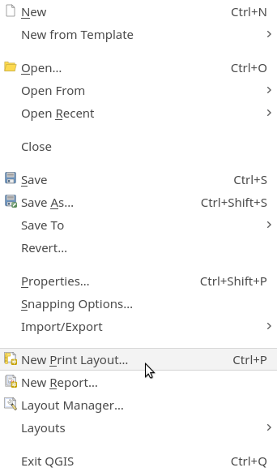

# Layout Composer

Kies een van de kaarten die je hebt gemaakt om in de Layout Composer verder uit te werken.

1. Ga naar **Project > New Print Layout**

2. Geef een naam of laat leeg. 

Je bent nu in de print layout composer terecht gekomen. Hier kan je de volledige kaart aankleden met een titel, legenda, uitsneden etc. 

3. Voeg je de kaart toe aan je blad.
4. Voeg een legenda toe en pas de legenda items aan.