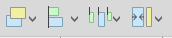
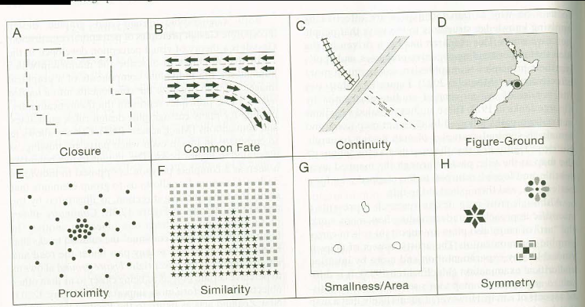

# Layout Composer

Kies een van de kaarten die je hebt gemaakt om in de Layout Composer verder uit te werken.

1. Ga naar **Project > New Print Layout**

2. Geef een naam of laat leeg. 

Je bent nu in de print layout composer terecht gekomen. Hier kan je de volledige kaart aankleden met een titel, legenda, uitsneden etc. 

Aan de linker kant vind je alle knoppen om de onderdelen van je kaart toe tevoegen:

Boven aan vind je de knoppen om de inhoud op de juiste plek te krijgen:

Aan de rechterkant vind je de item properties, waar je per item de instellingen kan aanpassen. De laag volgorde kan bepalen en je pagina instellingen kan veranderen. 

3. Voeg je de kaart toe aan je blad door op de volgende knop te drukken en dan een vierkant te slepen.

4. Voeg een legenda toe en pas de legenda items aan.

Denk bij het maken aan je samenstelling aan wat voor verhaal je wilt vertellen. Ga een paar Gestalt en Tropes regels af en zie hoe jij ze kan toepassen! 

